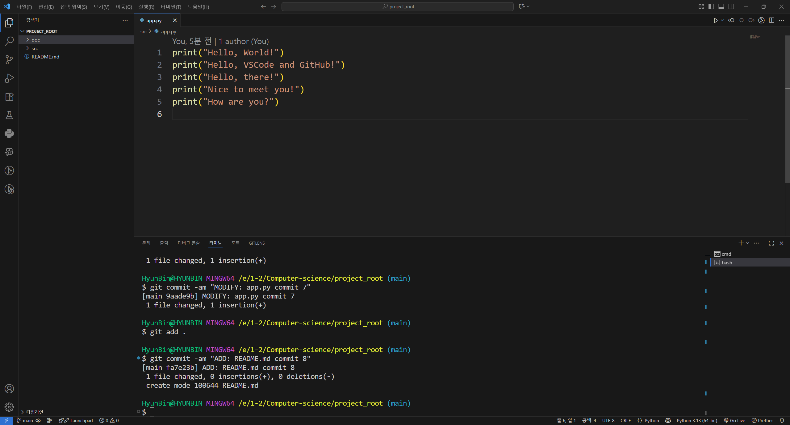

# Python GitHub 과제

## 1. 과제 개요
- VS Code에서 Python 프로젝트를 생성하고 Git/GitHub을 활용하여 버전 관리 및 저장소 연동을 실습한다.  
- commit 메시지 규칙:  
  - 첫 번째: `ADD: ...`  
  - 이후 기능 추가: `MODIFY: ...`  
  - 코드 수정: `FIX: ...`  

---

## 2. 프로젝트 폴더 구조
```
project_root/
 ├─ src/
 │   └─ app.py
 ├─ doc/
 │   └─ images/
 │       ├─ capture1.png
 │       └─ capture2.png
 └─ README.md
```

---

## 3. 수행 과정
1. **src/app.py 작성 및 첫 commit**
   - commit 메시지: `ADD: app.py commit 1`  
   - 기능: [app.py 추가]  

2. **두 번째 commit**
   - commit 메시지: `MODIFY: app.py commit 2`  
   - 수정/추가한 내용: [print("Hello, VSCode and GitHub!") 추가]  

3. **세 번째 commit**
   - commit 메시지: `FIX: app.py commit 3`  
   - 수정/추가한 내용: [print("Hello, World!")로 수정]  

4. **네 번째 commit**
   - commit 메시지: `MODIFY: app.py commit 4`  
   - 수정/추가한 내용: [print("Hello, VSCode and GitHub!") 추가]  

5. **다섯 번째 commit**
   - commit 메시지: `MODIFY: app.py commit 5`  
   - 수정/추가한 내용: [print("Hello, there!") 추가]  

6. **여섯 번째 commit**
   - commit 메시지: `MODIFY: app.py commit 6`  
   - 수정/추가한 내용: [print("Nice to meet you!") 추가]  

7. **일곱 번째 commit**
   - commit 메시지: `MODIFY: app.py commit 7`  
   - 수정/추가한 내용: [print("How are you?") 추가]  

8. **여덟 번째 commit**
   - commit 메시지: `ADD: README.md commit 8`  
   - 수정/추가한 내용: [README.md 추가]  

9. **아홉 번째 commit**
   - commit 메시지: `ADD: capture1.png, capture2.png commit 9`  
   - 수정/추가한 내용: [capture1.png, capture2.png 추가]

10. **열 번째 commit**
    - commit 메시지: `MODIFY: README.md commit 10`  
    - 수정/추가한 내용: [README.md 템플릿 내용 추가]

11. **열한 번째 commit**
    - commit 메시지: `FIX: README.md commit 11`  
    - 수정/추가한 내용: [열 번째, 열한 번째 commit 내용 추가, capture1 경로 수정]

12. **열두 번째 commit**
    - commit 메시지: `FIX: README.md commit 12`  
    - 수정/추가한 내용: [첫 번째 ~ 열한 번째 commit 메시지 수정, 열두 번째 commit 내용 추가]

---

## 4. 캡처 이미지
- `capture.png` → commit 완료 상태 화면  
- `capture2.png` → GitHub push → pull 후 VS Code 화면  

예시:  
  
  

---

## 5. GitHub Repository URL
- URL: [https://github.com/HyunBin24/project_root]  

---

## 6. 느낀 점 (선택 사항)
- 이번 과제를 하면서 배운 점: VSCode 터미널로 add, commit, push, pull 등을 할 수 있다. 
- Git/GitHub을 활용하며 어려웠던 점: VSCode와 GitHub 연동해서 사용하는 게 어려웠다.
- 앞으로 더 해보고 싶은 것: VSCode와 GitHub 연동을 좀 더 능숙하게, 막힘없이 사용하고 싶다..